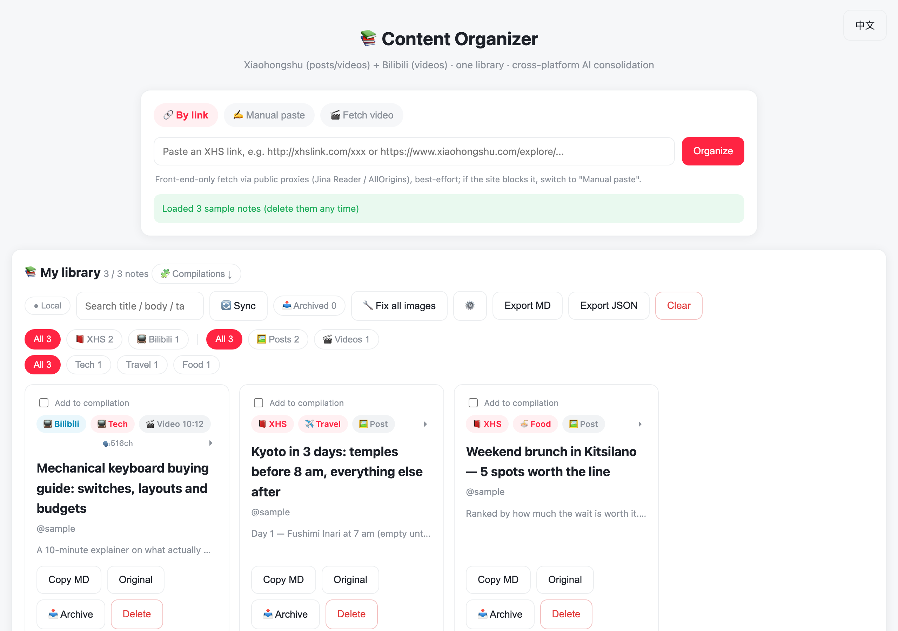

# Content Organizer

One library for the things you save on **Xiaohongshu** (posts and videos) and **Bilibili** (videos),
with an AI step that turns a pile of saved items into one de-duplicated, sectioned write-up.
A static single-page app with no build step and no server of its own: your data lives in your
browser and in a private GitHub repo you control, and every API key stays on your machine.

**Live demo:** https://nickkklian.github.io/content-organizer/?demo=1 — three sample notes, English by
default, 中文 toggle in the corner. Nothing is fetched or saved until you connect your own repo.



## What it does

- **Capture** — paste a Xiaohongshu link (fetched through public reader proxies and parsed from the
  page's embedded state), or paste the share text by hand, or hand a video link to a small local
  service that transcribes it on your own Mac.
- **Organise** — automatic categorisation by keyword scoring (tags weigh more than titles, titles
  more than body), platform / type / category filters, search, archive, Markdown and JSON export.
- **Consolidate** — tick several notes and let Claude merge them into one piece: de-duplicated,
  grouped into sections, with every section pointing back at its sources. Images can be sent along
  so text inside menus, slides and price lists ends up in the write-up; the model also decides which
  images are worth keeping because text can't replace them.
- **Keep it** — images on Xiaohongshu's CDN carry a signed expiry; the app archives them into your
  private repo so saved notes don't rot, and offers a one-click repair for notes whose links already
  died.

## How it's built

| Concern | Approach |
|---|---|
| Front end | Vanilla JS modules, one HTML file, no bundler. Loads in the order `i18n → classify → parse → store → sync → images → fetch → ai → app` |
| Local storage | IndexedDB, with a one-time migration from localStorage. The origin hosts many apps and the ~5 MB localStorage quota is shared, so transcripts were silently failing to save — the store now throws visibly instead |
| Cloud sync | A single `content.json` in a private GitHub repo via the Contents API. Merge is union + tombstones + latest-`savedAt`-wins, so several devices can write concurrently; a `sha` conflict triggers one re-pull-and-retry |
| Image archiving | Fetched through an image proxy (CORS), compressed to 1080px WebP, committed to the repo; rendered back as blob URLs with the token. A cache-key subtlety with GitHub's `Accept`-negotiated responses is documented inline in `js/images.js` |
| AI | Claude Messages API called directly from the browser with **structured output** (a JSON schema), so the sectioned result never needs parsing heuristics. Output language follows the UI language |
| Video ingest | `local/content_server.py` — a tiny HTTP service on `127.0.0.1` that uses `yt-dlp` (with your browser cookies), `faster-whisper` for transcription and PyAV for key frames, streaming progress over **Server-Sent Events**. It returns candidate frames only; Claude vision in the browser judges which are informative |
| Secrets | GitHub token, Anthropic key and the local service token live only in this browser's storage. Nothing is ever written into a repo |
| Language | English by default, 中文 via the toggle; the preference is remembered in localStorage |

```
index.html            shell; static strings carry data-i18n keys
styles.css            layout, card folding, 4 → 2 → 1 column grid, phone rules
js/i18n.js            dictionary + T(zh, en) helper
js/classify.js        keyword categoriser (Chinese keywords — the content is Chinese)
js/parse.js           Xiaohongshu fetch chain: Jina HTML → Jina markdown → AllOrigins → manual
js/store.js           IndexedDB store with synchronous API and localStorage fallback
js/sync.js            private-repo sync, tombstone merge, legacy bootstrap
js/images.js          archiving, expiry detection, proxy fallbacks, vision sizing
js/fetch.js           client for the local video service (EventSource)
js/ai.js              consolidation + frame judging (structured outputs)
js/app.js             UI, sample data, event wiring
local/                the optional video service and its double-click toggle app (see local/README.md)
```

## Design notes worth reading in the code

- `js/store.js` — why put/get must be separate helpers, and why a failed write must throw rather than
  return.
- `js/images.js` — why the sha-lookup request uses `cache: 'no-store'`: Chrome cached a raw WebP
  under the same URL and a later JSON request received image bytes.
- `styles.css` — why the grid uses `minmax(0, 1fr)`: with real cards, `1fr` let a column grow to
  668px on a 375px phone, and an empty library can't reveal it.
- `local/content_server.py` — the measured frame-difference thresholds behind `SCENE_THR`.

## Running it locally

```bash
python3 -m http.server 8765        # then open http://localhost:8765/?demo=1
```

Cloud sync and image archiving need a fine-grained GitHub token with Contents read/write on a private
repo of yours; AI features need an Anthropic API key. Both are entered in ⚙️ Settings and stored only in
the browser. The video service is optional — see [`local/README.md`](local/README.md).

## Limitations

- Xiaohongshu fetching is best-effort through public proxies and fails on login walls; manual paste
  always works.
- Categorisation is keyword-based and tuned for Chinese content; English notes mostly land in "Other"
  unless they carry Chinese tags.
- Calling the Anthropic API from a browser requires the `anthropic-dangerous-direct-browser-access`
  header; the key never leaves your machine, but this is a personal-tool trade-off, not a pattern for
  multi-user products.

## License

MIT.
