# Clipbind

**What you saved on Xiaohongshu and Bilibili, bound into one piece you can read.**

One library for the things you save on **Xiaohongshu** (posts and videos) and **Bilibili** (videos),
an AI step that binds a pile of them into one de-duplicated, sectioned write-up, and a reading view
that shows the result as what it is: a piece of writing, with every section pointing back at the
posts it was made from. A static single-page app with no build step and no server of its own: your
data lives in your browser and in a private GitHub repo you control, and every API key stays on your
machine.

**Live demo:** https://nickkklian.github.io/content-organizer/?demo=1 — three sample notes, English by
default, 中文 toggle in the corner. Nothing is fetched or saved until you connect your own repo. The
sample notes are what this library is for: saved social posts, with Chinese tags, because that is what
they carry.


## What it does

- **Capture** — paste a Xiaohongshu link (fetched through public reader proxies and parsed from the
  page's embedded state), or paste the share text by hand, or hand a video link to a small local
  service that transcribes it on your own Mac.
- **Organise** — automatic categorisation by keyword scoring (tags weigh more than titles, titles
  more than body), platform / type / category filters, search, archive, Markdown and JSON export.
- **Consolidate** — tick several notes and let Claude merge them into one piece: de-duplicated,
  grouped into sections, with every section pointing back at its sources. Images can be sent along
  so text inside menus, slides and price lists ends up in the write-up; the model also decides which
  images are worth keeping because text can't replace them.
- **Read it** — a compilation opens in its own view: the sections in reading order down a measured
  column, a table of contents beside them, and one numbered list of everything the piece was made
  from. Each section carries the numbers it drew on, and each number is a link into that list. The
  keyboard goes with the reader — a link to a section lands on its heading, a reference lands on the
  entry in the source list — and none of it touches the URL.
- **Keep it** — images on Xiaohongshu's CDN carry a signed expiry; the app archives them into your
  private repo so saved notes don't rot, and offers a one-click repair for notes whose links already
  died.

## How it's built

| Concern | Approach |
|---|---|
| Front end | Vanilla JS modules, one HTML file, no bundler. Loads in the order `i18n → samples → classify → parse → merge → refs → store → sync → images → fetch → ai → app` |
| Rules under test | The two things that would fail silently are pure functions in files of their own, DOM-free, loaded by the browser with `<script>` and by node with `require` — the file the browser runs is the file the tests run. `js/merge.js` is what happens when two devices have both written; `js/refs.js` is the numbered source list the reading view prints. `node check.mjs` runs 36 cases; `node check.mjs --break` breaks each rule in a copy and requires **the case written for it** to be the one that fails |
| Stylesheet under test | `node check-css.mjs`: every class the app puts on an element has a rule, every rule is for a class it renders. Written after a restyle silently dropped the rules for twenty-two classes — error messages rendered in the neutral information style and nothing threw |
| Local storage | IndexedDB, with a one-time migration from localStorage. The origin hosts many apps and the ~5 MB localStorage quota is shared, so transcripts were silently failing to save — the store now throws visibly instead |
| Cloud sync | A single `content.json` in a private GitHub repo via the Contents API. Merge is union + tombstones + latest-`savedAt`-wins, so several devices can write concurrently; a `sha` conflict triggers one re-pull-and-retry |
| Image archiving | Fetched through an image proxy (CORS), compressed to 1080px WebP, committed to the repo; rendered back as blob URLs with the token. A cache-key subtlety with GitHub's `Accept`-negotiated responses is documented inline in `js/images.js` |
| AI | Claude Messages API called directly from the browser with **structured output** (a JSON schema), so the sectioned result never needs parsing heuristics. Output language follows the UI language |
| Video ingest | `local/content_server.py` — a tiny HTTP service on `127.0.0.1` that uses `yt-dlp` (with your browser cookies), `faster-whisper` for transcription and PyAV for key frames, streaming progress over **Server-Sent Events**. It returns candidate frames only; Claude vision in the browser judges which are informative |
| Secrets | GitHub token, Anthropic key and the local service token live only in this browser's storage. Nothing is ever written into a repo |
| Language | English by default, 中文 via the toggle; the preference is remembered in localStorage |

```
index.html            shell; static strings carry data-i18n keys
styles.css            layout, card folding, 4 → 2 → 1 column grid, phone rules
js/i18n.js            dictionary + T(zh, en) helper
js/samples.js         the three sample notes ?demo=1 loads, and what the cached demo compilation was made from
js/classify.js        keyword categoriser (Chinese keywords — the content is Chinese)
js/parse.js           Xiaohongshu fetch chain: Jina HTML → Jina markdown → AllOrigins → manual
js/merge.js           the merge rules: union by id, tombstones win, latest savedAt wins (DOM-free, tested)
js/refs.js            one numbered source list per compilation, and the numbers each section cites (DOM-free, tested)
js/store.js           IndexedDB store with synchronous API and localStorage fallback
js/sync.js            private-repo sync, tombstone merge, legacy bootstrap
js/images.js          archiving, expiry detection, proxy fallbacks, vision sizing
js/fetch.js           client for the local video service (EventSource)
js/ai.js              consolidation + frame judging (structured outputs)
js/app.js             UI, sample data, event wiring
local/                the optional video service and its double-click toggle app (see local/README.md)
check.mjs             36 cases over js/merge.js and js/refs.js; --break has to make the right one fail
check-css.mjs         every rendered class has a rule, every rule is rendered; --break deletes rules to show it goes red
make-demo-compilation.mjs   runs the AI step once with your key and writes demo/compilation.json
```

## How a pile of saved posts becomes one piece

```mermaid
%%{init: {"theme": "base", "themeVariables": {"darkMode": false, "fontFamily": "Inter, BlinkMacSystemFont, Segoe UI, Helvetica Neue, Helvetica, Arial", "primaryColor": "#dae7db", "mainBkg": "#dae7db", "primaryTextColor": "#1d1b24", "nodeTextColor": "#1d1b24", "textColor": "#1d1b24", "primaryBorderColor": "#2f5859", "nodeBorder": "#2f5859", "secondaryColor": "#fae8eb", "tertiaryColor": "#f7e9e8", "lineColor": "#5f7f76", "arrowheadColor": "#5f7f76", "defaultLinkColor": "#5f7f76", "edgeLabelBackground": "#fae8eb", "clusterBkg": "#f7e9e8", "clusterBorder": "#a8707a", "titleColor": "#7d2d44"}}}%%
flowchart LR
  X["Xiaohongshu link<br/>or pasted text"] --> P[parse.js]
  V["Bilibili / XHS video"] --> L["local/content_server.py<br/>yt-dlp + whisper + frames"]
  L --> P
  P --> C[classify.js]
  C --> S[("store.js<br/>IndexedDB")]
  S <-->|"content.json<br/>merge.js"| G[("your private repo")]
  S -->|"tick several notes"| A["ai.js<br/>Claude, JSON schema"]
  A --> K["compilation<br/>sections + source_indices"]
  K --> R["refs.js<br/>numbered sources"]
  R --> D["reading view"]
  S -->|"images.js"| G
```



## The reading view

A compilation is a piece of writing, and the card grid it was made in is a filing cabinet: four folded
cards to a row, every section expanded inside a quarter of the window, the buttons that re-run and
delete it directly underneath. **Read** opens it in its own surface instead — sections in reading
order down a measured column, a table of contents beside them, and one numbered list of everything
the piece was made from.

Building that list is the part with rules, so it is `js/refs.js` and it has cases:

- the URL is the identity and the title is the fallback, because one post cited by three sections
  under slightly different titles is one entry in the list, not three;
- numbering follows first appearance in reading order, so `[1]` is the first source the reader meets;
- a source with neither URL nor title is dropped — there is nothing for the number to point at;
- a note that was consolidated in but that no section cites is still listed, after the cited ones and
  marked, because it did go into the piece.

Those four decisions are also the four breaks `node check.mjs --break` makes in it.

## Design notes worth reading in the code

- `js/store.js` — why put/get must be separate helpers, and why a failed write must throw rather than
  return.
- `js/images.js` — why the sha-lookup request uses `cache: 'no-store'`: Chrome cached a raw WebP
  under the same URL and a later JSON request received image bytes.
- `styles.css` — why the grid uses `minmax(0, 1fr)`: with real cards, `1fr` let a column grow to
  668px on a 375px phone, and an empty library can't reveal it.
- `local/content_server.py` — the measured frame-difference thresholds behind `SCENE_THR`.

## Running it locally

```bash
python3 -m http.server 8765        # then open http://localhost:8765/?demo=1
node check.mjs                     # 36 cases over the merge rules and the source list
node check.mjs --break             # breaks each rule; the case written for it has to be the one that fails
node check-css.mjs                 # every rendered class has a rule, and back
node check-css.mjs --break         # deletes rules to show the check can go red
```

Cloud sync and image archiving need a fine-grained GitHub token with Contents read/write on a private
repo of yours; AI features need an Anthropic API key. Both are entered under **Connections** and stored
only in the browser. The video service is optional — see [`local/README.md`](local/README.md).

`demo/compilation.json` is the sample notes put through the AI step once and kept; where it is present,
`?demo=1` opens the reading view with no key of your own. The model answers in the language the interface was in, so
there is one file per language and the page loads yours first. To make them (one API call each, a few cents):

```bash
ANTHROPIC_API_KEY=sk-ant-… node make-demo-compilation.mjs            # demo/compilation.json
ANTHROPIC_API_KEY=sk-ant-… node make-demo-compilation.mjs --lang zh  # demo/compilation.zh.json
```

It loads `js/ai.js` — the same file the browser runs, not a copy of the prompt — so what the demo shows
is what the app does. Each file records the model, the language and the date, and the reading view shows them.

## Limitations

- Xiaohongshu fetching is best-effort through public proxies and fails on login walls; manual paste
  always works.
- Categorisation is keyword-based and tuned for Chinese content; English notes mostly land in "Other"
  unless they carry Chinese tags.
- Calling the Anthropic API from a browser requires the `anthropic-dangerous-direct-browser-access`
  header; the key never leaves your machine, but this is a personal-tool trade-off, not a pattern for
  multi-user products.
- The merge rules are tested; the interface around them is not. `check.mjs` covers what happens when two
  devices have both written and what the reading view's source list should say — not the rendering, the
  fetching or the sync's HTTP handling, which are exercised by using the app.
- A compilation is what one model run produced. Re-running **Re-organize** tightens it, and editing it by
  hand is the other half of that — neither is a claim that the result is right.

## License

MIT.
